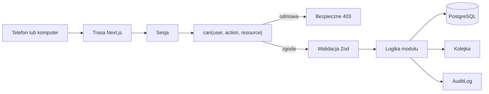

# Architektura

Jedna aplikacja Next.js zawiera stronę szkoły, panele i serwer. Bez mikroserwisów
i osobnego backendu.

```text
app/                         trasy i kompozycja
modules/access-control/      centralne uprawnienia
modules/brand/               treści i kontakt marki
modules/demo-data/           wyłącznie dane syntetyczne
modules/observability/       redakcja i diagnostyka
modules/identity/            konta i role
modules/people/              uczniowie, rodzice, wykładowcy
modules/groups/              grupy i zapisy
modules/schedule/            grafik i kolizje
modules/attendance/          lekcje i obecności
modules/notifications/       in-app, e-mail, SMS
modules/contracts/           wersje i akceptacje
modules/messaging/           rozmowy i audyt
lib/                         baza, auth, logi
prisma/                      schemat i migracje
scripts/                     instalacja i wydania
```

Moduły powstają dopiero w przypisanym etapie.

## Przepływ



Rola i `schoolId` pochodzą wyłącznie z sesji serwerowej. Samo ID w URL nie daje
dostępu. Domyślne `can(...)` zwraca `false`.

## Grafik

Konflikt istnieje, gdy nakładają się przedziały i wspólny jest zasób: sala,
wykładowca lub grupa. UI pokazuje błąd szybko, ale autorytatywna kontrola działa
w transakcji na serwerze. W Etapie 3 wybieramy ograniczenie PostgreSQL lub
równoważną blokadę współbieżności.

## Integracje

E-mail, SMS i pliki mają interfejsy dostawców. Masowa wysyłka zawsze tworzy
zadania kolejki z tempem, ponowieniami i limitem kosztu.

## Obserwowalność

Każde żądanie serwera docelowo dostaje `requestId`, który łączy log techniczny,
zdarzenie Sentry i `FeedbackReport`. Logi są strukturalnymi rekordami JSON.
Warstwa redakcji działa przed transportem do zewnętrznego dostawcy.

Klient przechowuje w pamięci krótki bufor zdarzeń. Eksport wymaga działania
użytkownika i nie odczytuje localStorage, cookie ani zawartości formularzy.
Pełny projekt opisuje `OBSERVABILITY_I_ZGLOSZENIA.md`.

## Środowiska

- local: syntetyczne dane i lokalny PostgreSQL,
- staging: osobna baza, wyłącznie dane syntetyczne,
- production: osobna baza i sekrety, po odbiorze.

Nie kopiujemy produkcyjnej bazy na staging.

## Wdrożenie

`next build` tworzy `.next/standalone`. `npm run package:release` pakuje serwer,
zasoby, instrukcje i plik startowy. Szczegóły: `DEPLOYMENT_MYDEVIL.md`.
