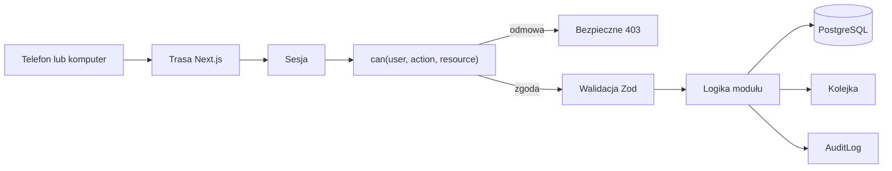

# Architektura

Jedna aplikacja Next.js zawiera stronę szkoły, panele i serwer. Bez mikroserwisów
i osobnego backendu.

```text
app/                         trasy i kompozycja
modules/access-control/      centralne uprawnienia
modules/brand/               treści i kontakt marki
modules/site-content/        publiczne treści, walidacja i edytor
modules/demo-data/           wyłącznie dane syntetyczne
modules/observability/       redakcja i diagnostyka
modules/identity/            konta i role
modules/people/              uczniowie, rodzice, wykładowcy
modules/groups/              grupy i zapisy
modules/imports/             podgląd i transakcyjny zapis CSV/XLSX
modules/schedule/            grafik i kolizje
modules/attendance/          lekcje i obecności
modules/notifications/       in-app, e-mail, SMS
modules/contracts/           wersje i akceptacje
modules/messaging/           rozmowy i audyt
modules/payments/            ręczne statusy i historia
modules/learning-content/    materiały i zadania
modules/files/               metadane prywatnych plików
modules/jobs/                Outbox i zadania kolejki
lib/                         baza, auth, logi
prisma/                      schemat i migracje
scripts/                     instalacja i wydania
```

Moduły powstają dopiero w przypisanym etapie.

## Tożsamość i dostęp — Etap 1

Better Auth obsługuje hasła, sesje, reset oraz TOTP. Adapter Prisma zapisuje
rekordy uwierzytelniania w tej samej bazie PostgreSQL. Publiczna rejestracja
jest wyłączona.

Zaproszenie zawiera losowy token, ale baza przechowuje wyłącznie jego skrót
SHA-256. Link działa raz i przez 7 dni. Utworzenie, cofnięcie i użycie
zaproszenia tworzy `AuditLog` bez adresu e-mail i tokenu.

Kod QR jest wyłącznie inną formą przekazania tego samego linku. Rola pochodzi
z zaproszenia, nie z formularza rejestracji. Jedna strona logowania odczytuje
rolę z aktywnej sesji i przekierowuje do właściwego panelu.

Każda chroniona strona pobiera sesję na serwerze, sprawdza `schoolId`, status
konta, rolę oraz centralne `can(...)`. Dyrektor bez aktywnego TOTP jest
przekierowany do konfiguracji, zanim zobaczy swój panel.

## Kartoteki i import — Etap 2

Sale, grupy, wykładowcy, rodzice i uczniowie należą do jednej szkoły przez
`schoolId`. Uczeń może istnieć bez konta logowania i ma szkolny identyfikator
zewnętrzny. Relacje rodzic–dziecko, zapisy do grup i przydziały wykładowców są
osobnymi rekordami, które można archiwizować bez niszczenia historii.

Import CSV/XLSX ma dwie jawne fazy. Podgląd waliduje nagłówki, limity,
powiązania i duplikaty, a oryginalny plik zapisuje poza `public/`. Zatwierdzenie
ponownie odczytuje plik, sprawdza jego SHA-256 i wykonuje cały zapis w jednej
transakcji. Log audytowy przechowuje wyłącznie liczby i identyfikatory
techniczne, bez treści arkusza.

Eksport jest chronioną trasą dyrektora. Generuje CSV zgodny z parserem importu,
pomija techniczne adresy rekordów bez konta i zapisuje w audycie tylko liczby.
Import, eksport i historia operacji są oddzielone od codziennego katalogu osób.

## Edytowalna strona publiczna

`modules/site-content/schema.ts` jest jednym kontraktem treści dla strony i
panelu dyrektora. Domyślne treści są wersjonowane w repozytorium. Statyczne demo
zapisuje zatwierdzony obiekt w `localStorage` pod kontrolą Zod, dzięki czemu
klientka może ocenić UX bez publicznego endpointu zapisu.

To rozwiązanie jest celowo przejściowe. Po uwierzytelnianiu:

- dyrektor zapisuje opublikowaną i roboczą wersję treści do PostgreSQL,
- zdjęcia trafiają do prywatnego `FileStorage`,
- publikacja jest chronioną akcją i tworzy `AuditLog`,
- poprzednią wersję można przywrócić,
- publiczna strona odczytuje tylko wersję opublikowaną.

Schemat Zod i komponenty edytora pozostają wspólne, więc migracja nie wymaga
projektowania interfejsu od początku.

## Przepływ



Rola i `schoolId` pochodzą wyłącznie z sesji serwerowej. Samo ID w URL nie daje
dostępu. Domyślne `can(...)` zwraca `false`.

## Grafik

Każda grupa i sala należą do jednej lokalizacji. Lekcja może użyć wyłącznie
sali z lokalizacji grupy; ta reguła jest sprawdzana na serwerze i przez solver.
Konflikt istnieje, gdy nakładają się przedziały i wspólny jest zasób: sala,
wykładowca, grupa albo uczeń zapisany do więcej niż jednej grupy. UI pokazuje
błąd szybko, ale autorytatywna kontrola działa w transakcji z blokadą doradczą
PostgreSQL per szkoła. Równoległe zapisy są dzięki temu sprawdzane kolejno.

Ręczny grafik i Asystent używają tych samych rekordów `ScheduleSlot` oraz tej
samej kontroli serwerowej. Przeciąganie jest skrótem. Formularz „Zmień termin”
pozostaje pełną alternatywą dla dotyku, myszy i klawiatury.

`ScheduleSolver` oddziela dane szkoły od algorytmu. Pilot ma deterministyczny
solver TypeScript odpowiedni dla małej liczby grup KLA:

1. tworzy możliwe terminy co 30 minut,
2. odrzuca niedostępność, za małą salę i każdą twardą kolizję,
3. układa najtrudniejsze grupy najpierw,
4. punktuje preferowane dni, godziny, sale i krótsze przerwy wykładowcy,
5. zapisuje `ScheduleGeneration` i `ScheduleProposalSlot` jako szkic,
6. publikuje dopiero po ponownym sprawdzeniu kolizji i decyzji dyrektora.

Asystent nie jest nazywany sztuczną inteligencją. To przewidywalna optymalizacja
ograniczeń z wyjaśnieniem wyniku. Jeżeli skala wzrośnie, nowy adapter może użyć
Timefold lub OR-Tools bez zmiany interfejsu, bazy ani ekranów.

Tygodniowa dostępność jest zapisana jako `AvailabilityWindow`, a potrzeby grupy
jako `SchedulingRequirement`. Dokładnie jeden zasób należy do okna
dostępności, a poprawność minut, dni i długości lekcji chronią także
ograniczenia bazy.

## Integracje

E-mail, SMS i pliki mają interfejsy dostawców. Masowa wysyłka zawsze tworzy
zadania kolejki z tempem, ponowieniami i limitem kosztu.

### Pliki

`FileStorage` oddziela metadane biznesowe od magazynu binarnego. Lokalnie zapis
działa w `.data/private-files` poza `public/`; staging i produkcja używają prywatnego
magazynu S3-compatible. Aplikacja wydaje krótkotrwały adres podpisany dopiero po
sprawdzeniu `can(...)`. Umowa, materiał i oddane zadanie wskazują rekord pliku,
nie publiczny URL.

### Kolejka i wysyłka

Tabela `Outbox` powstaje w tej samej transakcji co operacja biznesowa. Worker
pg-boss na PostgreSQL odbiera rekord, uruchamia odpowiedni provider i zapisuje
wynik, liczbę prób oraz bezpieczny kod błędu. Dzięki temu nie potrzebujemy
Redis w pilocie, a e-mail nie ginie po restarcie procesu.

### Umowy

`ContractVersion` jest append-only i zawiera skrót niezmiennego PDF.
`ContractAcceptance` wskazuje dokładną wersję i dowody akceptacji. Wbudowany
przepływ nie jest nazywany podpisem kwalifikowanym. `SignatureProvider` stanowi
granicę dla przyszłej integracji z dostawcą podpisu.

### Komunikator

PostgreSQL przechowuje wątki, uczestników, wiadomości i odczyty. Pilot pobiera
zmiany kontrolowanym odświeżaniem. Interfejs `RealtimeProvider` pozwala później
dodać WebSocket bez zmiany reguł uprawnień. Ogłoszenie masowe tworzy osobny
rekord odbiorcy i osobne zadanie wysyłki, więc ma mierzalny status.

### Płatności i zadania

`PaymentStatusChange` zachowuje historię ręcznych zmian bez obsługi kart lub
rachunków bankowych. Materiały i zadania korzystają z tego samego
`FileStorage`, ale mają odrębne reguły dostępu dla grupy, rodzica i ucznia.

## Obserwowalność

Każde żądanie serwera docelowo dostaje `requestId`, który łączy log techniczny,
zdarzenie Sentry i `FeedbackReport`. Logi są strukturalnymi rekordami JSON.
Warstwa redakcji działa przed transportem do zewnętrznego dostawcy.

Klient przechowuje w pamięci krótki bufor zdarzeń. Eksport wymaga działania
użytkownika i nie odczytuje localStorage, cookie ani zawartości formularzy.
Pełny projekt opisuje `OBSERVABILITY_I_ZGLOSZENIA.md`.

## Środowiska

- local: syntetyczne dane i lokalny PostgreSQL,
- staging: osobna baza, wyłącznie dane syntetyczne,
- production: osobna baza i sekrety, po odbiorze.

Nie kopiujemy produkcyjnej bazy na staging.

## Wdrożenie

`next build` tworzy `.next/standalone`. `npm run package:release` pakuje serwer,
migracje, zasoby, instrukcje i pliki `start.sh`/`migrate.sh`, a także osobny
instalator VPS budowany na docelowym Linuksie.
`npm run package:preview` buduje odrębny statyczny eksport bez tras
uwierzytelniania dla WebFTP home.pl. Szczegóły: `DEPLOYMENT_MYDEVIL.md` oraz
`DEPLOYMENT_HOME_VPS.md` i `INSTRUKCJA_HOME_PL.md`.
