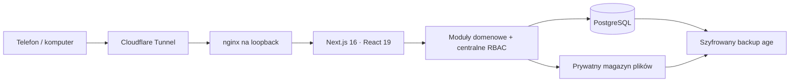

# eDziennik KLA

[Polski](README.md) · [English](README.en.md)

[](https://github.com/damianx9x/edziennik/actions/workflows/ci.yml)


[](LICENSE)

Mobilny system operacyjny prywatnej szkoły językowej: od pierwszego zaproszenia
przez grafik, komunikację i materiały aż po umowy, raty, obecność oraz postępy
ucznia. Interfejs został zaprojektowany dla dyrektora, wykładowcy, rodzica i
ucznia, a osobne centrum techniczne daje właścicielowi kontrolę nad serwerem,
backupem, zdarzeniami i bezpieczeństwem.

**Adres operacyjny:** [demo.kingslanguageacademy.pl](https://demo.kingslanguageacademy.pl)
**Projekt i rozwój:** Damian Eron · [damianx9x@me.com](mailto:damianx9x@me.com)

> Publiczny adres domyślnie pokazuje neutralną stronę produktu. Panel jest
> oddzieloną, uwierzytelnioną częścią docelowego systemu, a rejestracja bez
> zaproszenia pozostaje zamknięta. Zasady odpowiedzialnego sprawdzania opisuje
> [SECURITY.md](SECURITY.md).

## Co rozwiązuje produkt

Od września 2026 rozwój prowadzimy poprzez kolejne wersjonowane wydania, a nie
otwieranie następnych etapów pilota. [Stan, dowody testów i priorytety](docs/CURRENT_WORK.md)
oddzielają wykonane prace od warunków operacyjnych, które wymagają potwierdzenia.

| Obszar | Rezultat |
| --- | --- |
| grafik | ręczne układanie i asystent propozycji z kontrolą kolizji sali, grupy, wykładowcy, ucznia i przejazdu między lokalizacjami |
| kartoteki | osoby, relacje rodzinne, grupy, sale i lokalizacje w jednym modelu uprawnień |
| umowy i raty | niezmienne wersje PDF, pakiety dokumentów, ślad akceptacji, podpisany skan i ręczny status rat |
| komunikacja | rozmowy grupowe i bezpośrednie, ogłoszenia, załączniki oraz neutralne powiadomienia e-mail |
| nauka | materiały, zadania, prywatne oddania prac, obecność i informacja zwrotna |
| postępy | opisowe obserwacje i trendy umiejętności bez automatycznego oceniania dziecka |
| operacje | szyfrowany backup, test odtworzenia, rollback wydania, watchdog i centrum zdarzeń |

## Galeria

Pełna galeria widoków na telefonie i komputerze znajduje się w
[docs/GALLERY.md](docs/GALLERY.md).

| Neutralny pokaz produktu | Logowanie mobilne |
| --- | --- |
|  |  |

## Role i prywatność

- **Dyrektor** zarządza szkołą, zatwierdza zmiany grafiku, umowy i statusy rat.
- **Wykładowca** widzi własne grupy, ustawia dostępność, prowadzi lekcję i naukę.
- **Rodzic** widzi wyłącznie powiązane dzieci, ich formalności i komunikację.
- **Uczeń** widzi swój plan, naukę, obecność i postępy — bez spraw finansowych
  i formalnych rodzica.
- **Właściciel systemu** obsługuje infrastrukturę i audyt. Nie otrzymuje skrótu
  omijającego reguły integralności danych.

Autoryzacja działa na serwerze przy każdym odczycie i zapisie. Samo ukrycie
przycisku nigdy nie jest traktowane jako zabezpieczenie.

## Architektura w skrócie



To modularny monolit. Dla jednej szkoły oznacza mniej punktów awarii niż
mikroserwisy, a granice `modules/<feature>` i adaptery dostawców pozostawiają
drogę do późniejszego wydzielenia workerów lub magazynu S3-compatible.

### Stos

- Next.js 16 App Router, React 19, TypeScript 5.9;
- PostgreSQL + Prisma 7 z transakcjami i blokadami doradczymi;
- Better Auth, sesje cookie i TOTP MFA;
- Zod, Vitest, ESLint, real-browser QA;
- Raspberry Pi OS 64-bit, systemd, nginx, Cloudflare Tunnel, LUKS2, age,
  ClamAV, fail2ban i unattended-upgrades.

Głębszy opis decyzji, ryzyk i skalowania: [docs/ENGINEERING_HANDOFF.md](docs/ENGINEERING_HANDOFF.md).

## Pozycjonowanie na polskim rynku

Polski rynek ma dojrzałe produkty. [LangLion](https://langlion.com/faq/) łączy
obsługę szkoły językowej z modelem abonamentowym i modułami, a jego oficjalne
materiały opisują m.in. finanse, KSeF, zapisy oraz automatyzację komunikacji.
[LIBRUS Synergia](https://www.librus.pl/szkoly/) i
[Dziennik VULCAN](https://www.vulcan.edu.pl/szkoly-i-przedszkola/oprogramowanie/dziennik-vulcan)
są rozbudowanymi rozwiązaniami dla oświaty systemowej. eDziennik KLA nie
udaje ich zamiennika we wszystkich segmentach.

Ten projekt wybiera inną przewagę: kod źródłowy można audytować, wdrożenie może
pozostać pod kontrolą szkoły, a procesy można zmieniać pod konkretną placówkę
bez czekania na roadmapę zamkniętego dostawcy. Dotyczy to zwłaszcza grafiku
uwzględniającego lokalizacje i przejazdy, relacji rodzinnych, obiegu dokumentów
oraz właścicielskiego centrum operacyjnego. Otwartość nie usuwa kosztu
utrzymania — self-hosting wymaga odpowiedzialności za aktualizacje, monitoring,
backup i prawo. Dlatego repo zawiera te operacje razem z aplikacją, zamiast
traktować je jako niewidoczny dodatek.

Licencja AGPL-3.0 pozwala używać i modyfikować kod na jej warunkach, a przy
udostępnianiu zmodyfikowanej usługi przez sieć wymaga udostępnienia odpowiadającego
jej kodu źródłowego. Wdrożenia, integracje i wsparcie mogą być nadal oferowane
komercyjnie. Nazwa i znaki konkretnej szkoły są opisane osobno w [NOTICE](NOTICE).

## Bezpieczeństwo i niezawodność

- publiczna rejestracja jest wyłączona; konto powstaje przez ograniczone zaproszenie;
- centralna polityka RBAC działa domyślnie w trybie odmowy;
- pliki są poza `public/`, skanowane i pobierane przez autoryzowaną trasę;
- baza i dokumenty na Raspberry znajdują się w jednym sejfie LUKS2;
- kopie są szyfrowane `age`, testowane i mogą być wysyłane poza urządzenie;
- aktualizacja jest podpisana, budowana obok działającej wersji i ma rollback;
- centrum zdarzeń pokazuje operacje i wejścia bez haseł, tokenów, treści
  wiadomości i surowych adresów IP;
- nginx, limity aplikacji i Cloudflare chronią mały serwer przed gwałtownym ruchem.

Projekt jest utrzymywany w modelu **produkcja + rozwój**. Prawdziwe dane nadal wymagają zakończenia odbioru,
konfiguracji retencji, SMTP, kopii poza budynkiem, MFA oraz zatwierdzenia procesu
prawnego i RODO przez właściwych specjalistów.

## Uruchomienie dla programisty

Wymagane: Node.js 22–24 oraz PostgreSQL.

```bash
cp .env.example .env
npm ci
npm run db:generate
npm run db:migrate:deploy
npm run dev
```

Przed commitem:

```bash
npm run check
npm run build
npm run check:raspberry
```

Paczki wdrożeniowe:

```bash
npm run package:release
npm run package:raspberry
```

Instalacja i utrzymanie Raspberry: [docs/OPERACJE_RASPBERRY.md](docs/OPERACJE_RASPBERRY.md).

## Dokumentacja

- Po zalogowaniu wybierz ikonę **Instrukcja** w górnym pasku. Aplikacja pobiera
  PDF właściwy dla zalogowanej roli i zgodny dokładnie z uruchomioną wersją.
  Po pierwszym samouczku system proponuje jego pobranie. Podręcznik techniczny
  jest widoczny tylko dla właściciela systemu.
- [Podręcznik dyrektora — PDF](output/pdf/Podrecznik_eDziennika_KLA_dla_dyrektora.pdf)
- [Podręcznik wykładowcy — PDF](output/pdf/Podrecznik_eDziennika_KLA_dla_wykladowcy.pdf)
- [Podręcznik rodzica — PDF](output/pdf/Podrecznik_eDziennika_KLA_dla_rodzica.pdf)
- [Podręcznik ucznia — PDF](output/pdf/Podrecznik_eDziennika_KLA_dla_ucznia.pdf)
- [Instrukcja właściciela systemu — PDF](output/pdf/Instrukcja_eDziennika_KLA_dla_wlasciciela_systemu.pdf)
- [Funkcje i role](docs/FUNKCJE_I_ROLE.md)
- [Zakres i stan produktu](docs/PRODUCT_SCOPE.md)
- [Bieżący stan i dalsze prace](docs/CURRENT_WORK.md)
- [Architektura](docs/ARCHITEKTURA.md)
- [Bezpieczeństwo, prawo i RODO](docs/BEZPIECZENSTWO_PRAWO_RODO.md)
- [System UI](docs/SYSTEM_UI.md)
- [Odbiór i testy](docs/ODBIOR_I_TESTY.md)
- [Decyzje architektoniczne](docs/DECYZJE.md)
- [Notatki wydania](docs/RELEASE_NOTES.md)
- [Jak współtworzyć](CONTRIBUTING.md)

## Licencja i współpraca

Kod jest dostępny na licencji [GNU AGPL-3.0](LICENSE). Można go audytować,
uruchamiać, modyfikować i rozpowszechniać zgodnie z warunkami licencji. Sugestie
techniczne i odpowiedzialne raporty bezpieczeństwa są mile widziane przez
kanały opisane w [CONTRIBUTING.md](CONTRIBUTING.md) i [SECURITY.md](SECURITY.md).

Projekt i rozwój: Damian Eron, 2026. Nazwa i identyfikacja konkretnej szkoły nie
są udzielane na licencji wraz z kodem aplikacji.
