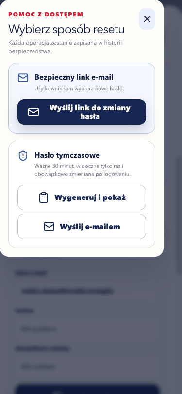
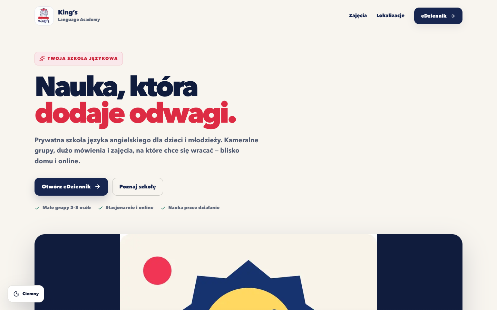
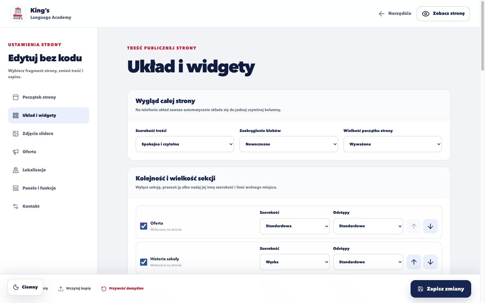
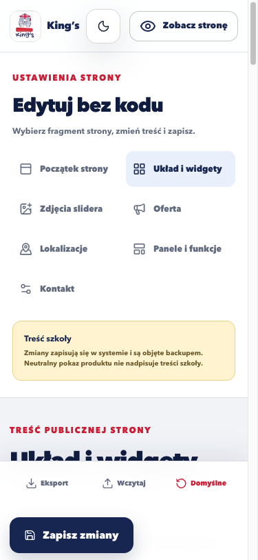
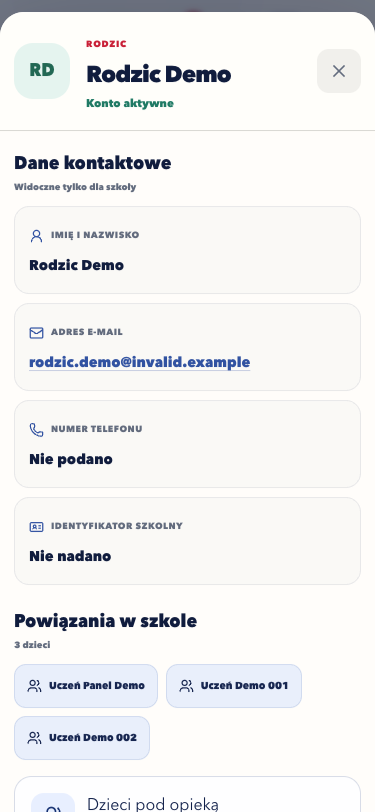

# Galeria produktu

Zrzuty powstają w automatycznej kontroli przeglądarkowej na 375 × 812 i
1440 × 900. Pokazują wyłącznie publiczne ekrany albo dane syntetyczne.

## Neutralna prezentacja produktu

Widok nie publikuje nazwy, lokalizacji, kontaktów ani zdjęć szkoły. Tryb strony
szkoły pozostaje konfigurowalny we wdrożeniu.

Zobacz pełną stronę produktu

## Logowanie mobilne

Logowanie jest wspólną, spokojną bramą do paneli ról. Publiczna rejestracja
pozostaje zamknięta: szkoła zaprasza konkretną osobę, a dyrektor może wysłać
link odzyskiwania albo wygenerować krótkotrwałe hasło tymczasowe.

## Strona szkoły i edytor bez kodowania

Publiczna strona może działać jako wizytówka konkretnej szkoły albo neutralna
prezentacja produktu. Dyrektor z delegowanym dostępem edytuje bez kodowania
tekst, zdjęcia, kolejność i szerokość sekcji oraz bezpieczne widgety.

| Edytor na komputerze | Edytor na telefonie |
| --- | --- |
|  |  |

Widget otrzymuje jeden z gotowych typów, rozmiar, akcent, krycie tła i styl
obramowania. Ograniczony katalog chroni dostępność oraz spójność; edytor nie
przyjmuje własnego HTML ani skryptu.

## Kartoteka i relacje rodzinne

Karta osoby łączy dane kontaktowe z powiązaniami w szkole. Dyrektor edytuje
rodziców, dzieci, grupy i wykładowców, a wykładowca otrzymuje tylko zakres
wynikający z przypisanych grup.

## Grafik — komputer i telefon

Widok desktopowy pokazuje tydzień i zależności zasobów. Na telefonie system
przechodzi na jeden dzień, kompaktowe wiersze czasu i dolną nawigację. Kolejne
zrzuty paneli chronionych są publikowane dopiero po sprawdzeniu, że zawierają
wyłącznie syntetyczne rekordy. Bieżące wydanie zachowuje te zrzuty jako prywatne
artefakty QA zamiast materiału marketingowego.

## Zasada publikacji

Galeria nie zawiera haseł, e-maili użytkowników, identyfikatorów sesji, logów,
adresów IP, treści umów ani dokumentów. Zrzut panelu właściciela może pokazywać
strukturę widoku, ale nie rzeczywiste zdarzenia lub parametry serwera.
