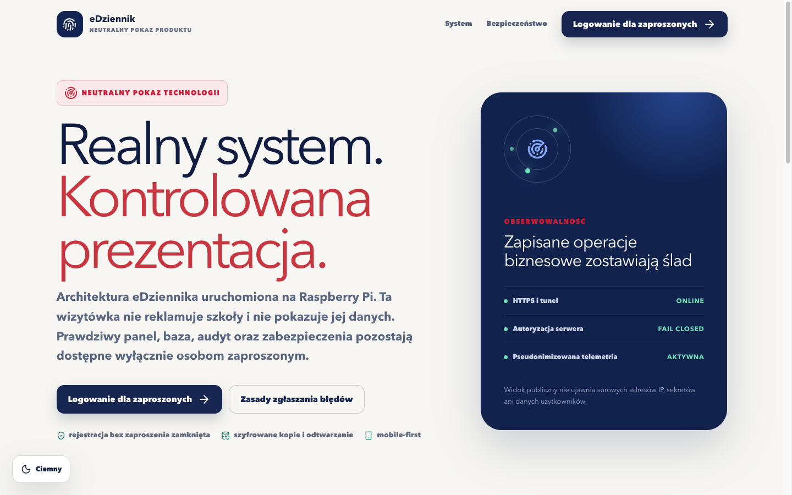
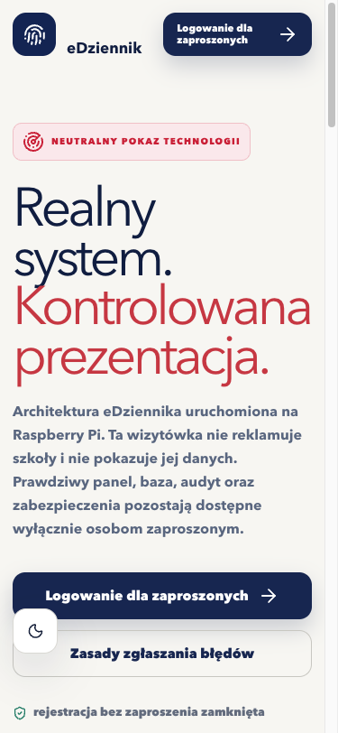
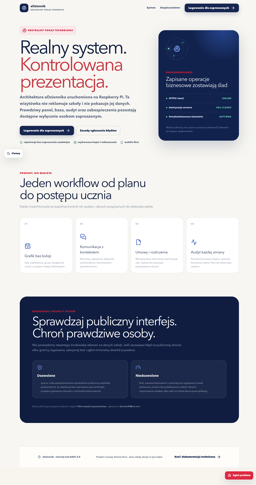

# Galeria produktu

Zrzuty powstają w automatycznej kontroli przeglądarkowej na 375 × 812 i
1440 × 900. Pokazują wyłącznie publiczne ekrany albo dane syntetyczne.

## Neutralna prezentacja produktu

Widok nie publikuje nazwy, lokalizacji, kontaktów ani zdjęć szkoły. Tryb strony
szkoły pozostaje konfigurowalny we wdrożeniu.

Zobacz pełną stronę produktu

## Logowanie mobilne

## Grafik — komputer i telefon

Widok desktopowy pokazuje tydzień i zależności zasobów. Na telefonie system
przechodzi na jeden dzień, kompaktowe wiersze czasu i dolną nawigację. Kolejne
zrzuty paneli chronionych są publikowane dopiero po sprawdzeniu, że zawierają
wyłącznie syntetyczne rekordy. Bieżące wydanie zachowuje te zrzuty jako prywatne
artefakty QA zamiast materiału marketingowego.

## Zasada publikacji

Galeria nie zawiera haseł, e-maili użytkowników, identyfikatorów sesji, logów,
adresów IP, treści umów ani dokumentów. Zrzut panelu właściciela może pokazywać
strukturę widoku, ale nie rzeczywiste zdarzenia lub parametry serwera.
