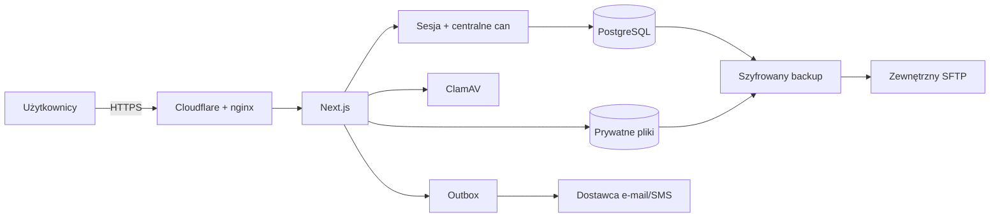

# Model zagrożeń eDziennika KLA

## 1. Executive summary

Najcenniejsze zasoby to dane dzieci i rodzin, wiadomości, umowy, płatności oraz
grafik. Najbardziej realne drogi ataku to przejęte konto dyrektora, błąd
izolacji roli, złośliwy załącznik, utrata Raspberry Pi i wadliwa aktualizacja.
System ma centralne uprawnienia, audyt, prywatny magazyn, skanowanie,
szyfrowanie i odwracalne wydania. Przed produkcją pozostają decyzje prawne,
retencja, zewnętrzny backup i obowiązkowe 2FA.

## 2. Scope and assumptions

Zakres obejmuje Next.js, PostgreSQL, prywatne pliki, adaptery e-mail/SMS,
Cloudflare/nginx oraz Raspberry Pi i VPS. Nie obejmuje bezpieczeństwa urządzeń
użytkowników ani wnętrza usług dostawców. Zakładamy jedną szkołę w pilocie, do
około 500 kont i 1–10 użytkowników naraz.

## 3. System model

Granice zaufania: Internet → proxy, przeglądarka → serwer, aplikacja → baza i
pliki, aplikacja → dostawcy, urządzenie → zewnętrzny backup. Role i `schoolId`
pochodzą z sesji (`modules/access-control/can.ts:73-86`).

## 4. Assets and security objectives

- poufność danych rodzin, rozmów i dokumentów,
- integralność grafiku, obecności, umów i płatności,
- niezmienność zaakceptowanej wersji umowy,
- dostępność panelu i rozliczalność operacji,
- poufność sekretów sesji, bazy i backupu.

## 5. Attacker model

Anonimowy napastnik, osoba z przejętym kontem, użytkownik próbujący rozszerzyć
dostęp, złośliwy załącznik, osoba z fizycznym dostępem oraz omyłkowa
aktualizacja. Nie zakładamy ochrony przed administratorem posiadającym
jednocześnie root, klucz LUKS i klucz backupu.

## 6. Threat analysis

| ID | Aktor i warunki | Działanie / zasób | Wpływ | Kontrole | Ryzyko resztkowe / zalecenie |
|---|---|---|---|---|---|
| T01 | zna hasło dyrektora | przejmuje panel | krytyczny | sesje, rate limit, TOTP | obowiązkowe 2FA, silne hasło |
| T02 | zalogowany zmienia ID | cudze dziecko/grupa | wysoki | `can`, `schoolId`, testy odmowy | test każdej nowej trasy |
| T03 | wysyła plik | malware/path traversal | wysoki | losowy klucz, 0600, sygnatura, ClamAV (`modules/files/storage.ts:46-67`) | limity i aktualne sygnatury |
| T04 | wstrzykuje treść | XSS i przejęcie sesji | wysoki | escaping, CSP nonce (`proxy.ts:5-31`) | utrzymać zakaz surowego HTML |
| T05 | operator wdraża błąd | przestój/niespójna baza | wysoki | CI, backup, healthcheck, rollback | test odtworzenia, zgodne migracje |
| T06 | kradnie Pi/SSD | odczyt danych | wysoki | LUKS2 (`raspberry/vault-create.sh:57-62`) | chronić klucz odzyskiwania |
| T07 | awaria urządzenia | brak usługi | średni | systemd, watchdog, backup | UPS, monitoring, zapasowe Pi |
| T08 | dyrektor czyta rozmowę | nadmierny nadzór | wysoki prawny | jawność i audit bez treści | regulamin, cel, retencja |
| T09 | atak na zależności | podatny build | wysoki | lockfile, audit, Dependabot | review PR, MFA GitHub |
| T10 | backup tylko lokalny | utrata wraz z serwerem | wysoki | age, adapter SFTP | uruchomić osobny cel |
| T11 | konto dyrektora wywołuje globalne API tożsamości | eskalacja roli / inna szkoła | krytyczny | dyrektor bez `adminAc`, własne akcje z `schoolId`, testy negatywne | powtarzać test po każdej zmianie Better Auth |
| T12 | dostawca e-mail przejmuje treść rozmów | ujawnienie komunikacji | wysoki | neutralny e-mail, HTTPS, allowlista hosta, brak redirectów, timeout | umowa powierzenia i review konfiguracji produkcyjnej |

## 7. Critical attack paths

1. Hasło demo → konto dyrektora → dane szkoły. Przerwanie: wyłączyć demo,
   zmienić hasła, włączyć TOTP i usunąć seedy.
2. Trasa bez `can`/`schoolId` → odgadnięte ID → dane rodziny. Przerwanie:
   centralna kontrola, review i negatywny test.
3. Paczka → destrukcyjna migracja → stary kod nie działa. Przerwanie: skaner,
   expand–migrate–contract, backup i restore test.
4. Kradzież urządzenia i kopii → próba odczytu. Przerwanie: LUKS2, age i SFTP
   poza lokalem.

## 8. Recommended priorities

1. 2FA dyrektora, usunięcie kont demo i silne sekrety.
2. Zatwierdzenie przez prawnika/IOD komunikatora, umów i retencji.
3. SFTP, alarm backupu i udokumentowane pełne odtworzenie.
4. Test docelowego Raspberry Pi z UPS i utratą sieci.
5. Test izolacji roli i `schoolId` dla każdego przyszłego modułu.

## 9. Assumptions and open questions

- Kto chroni urządzenie i klucz odzyskiwania? — do ustalenia.
- Jaki dostawca SFTP i wymagane RPO/RTO? — do ustalenia.
- Jakie retencje zatwierdzi prawnik/IOD? — otwarte.
- Czy po pilocie potrzebna będzie wysoka dostępność? — decyzja po pomiarach.
